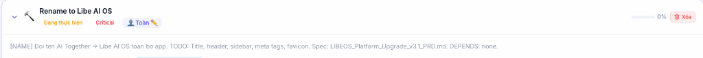

# IBSHI ERP — Libe AI OS Project Documentation

> **Dự án:** IBS HI (ERP System)  
> **Nền tảng quản lý:** Libe AI OS  
> **Ngày cập nhật:** 2026-03-11  
> **Người phụ trách:** Toàn 🧑‍💻

---

## 1. Tổng quan dự án trên Libe AI OS

Libe AI OS là nền tảng quản lý dự án tập trung của đội ngũ, nơi theo dõi toàn bộ task, workflow và tiến độ các projects.

### Dashboard tổng quan

**Mô tả:**
- Hiển thị toàn bộ các dự án đang hoạt động: BTNET, LBRC, MKT, VNPOST, IBS HI, XECA
- Phân quyền và workflow rõ ràng cho từng thành viên
- Tổng hợp task theo trạng thái, deadline, và mức ưu tiên
- Tích hợp AI Team Platform cho việc phối hợp nhóm

---

## 2. Task hiện tại: Rename to Libe AI OS

### Chi tiết task

**Thông tin task:**
- **Tên task:** Rename to Libe AI OS
- **Trạng thái:** Đang thực hiện
- **Mức ưu tiên:** Critical
- **Người phụ trách:** Toàn 🧑‍💻
- **Mô tả:** 
  - `[NAME]` Đổi tên AI Together → Libe AI OS toàn bộ app
  - **TODO:** Title, header, sidebar, meta tags, favicon
  - **Spec:** `LibeOS_Platform_Upgrade_v31_PRD.md`
  - **DEPENDS:** none

---

## 3. Thành tựu dự án IBSHI đã hoàn thành

| Task ID | Tên task | Trạng thái | Ưu tiên |
|---------|----------|------------|---------|
| T-010 | Module kế toán IBS HI - Sprint 1 | ✅ Done | Critical |
| T-011 | API đồng bộ kho hàng | ✅ Done | High |
| T-012 | Kết nối API kế toán ↔ kho | ✅ Done | High |
| T-015 | Prototype màn hình quản lý kho | ✅ Done | Medium |
| T-041 | Module HCNS (Nhân sự) — 7 sub-modules | ✅ Done | Critical |
| T-042 | Module Payroll (Lương) — 5 sub-modules + 10 bước duyệt | ✅ Done | Critical |
| T-043 | Migrate SQLite → Supabase PostgreSQL | ✅ Done | Critical |
| T-044 | Deploy Vercel Serverless + CDN | ✅ Done | Critical |
| T-045 | Excel Export/Import chấm công | ✅ Done | High |
| T-046 | Git + GitHub + Vercel CI/CD | ✅ Done | High |

---

## 4. Thông số kỹ thuật

- **Backend:** Python FastAPI trên Vercel Serverless
- **Database:** Supabase PostgreSQL (101 tables, 78K+ rows)
- **Frontend:** Static HTML/JS/CSS + CDN
- **CI/CD:** GitHub → Vercel auto-deploy
- **Repo:** `toanduc1993-cmd/ibshi-erp` (private)
- **URL Production:** `backend-toans-projects-c66566e9.vercel.app`

---

*Tài liệu được tạo tự động bởi Antigravity AI Agent — 2026-03-11*
